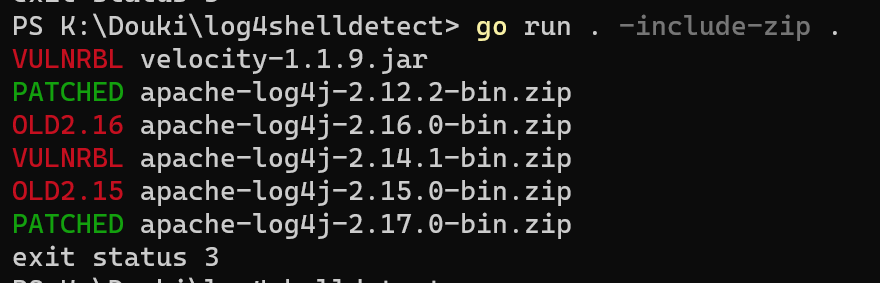

# log4shelldetect

Scans a file or folder recursively for Java programs that may be vulnerable to:

- CVE-2021-44228 (Log4Shell) (v2.0.x - v2.14.x)
- CVE-2021-45046 (v2.15.x)
- CVE-2021-45105 (v2.16.x)[^*]
- CVE-2021-44832 (v2.17)

[^*]: 2.12.2 detection is not available yet pending 2.12.3's release which I will need to test. 2.12.2 will appear as patched.

by inspecting the class paths inside files.

If you only want possibly vulnerable files to be printed rather than all files, run with `-mode list`.



## Usage

```
Usage: log4shelldetect [options] <path>

Options:
  -include-zip
        include zip files in the scan
  -mode string
        the output mode, either "report" (every java archive pretty printed) or "list" (list of potentially vulnerable files) (default "report")
```

## License

Code here is released to the public domain under [unlicense](/LICENSE).

With the exception of `velocity-1.1.9.jar` which is an example vulnerable `.jar` file part of [Velocity](https://github.com/PaperMC/Velocity) which is licensed under GPLv3.
